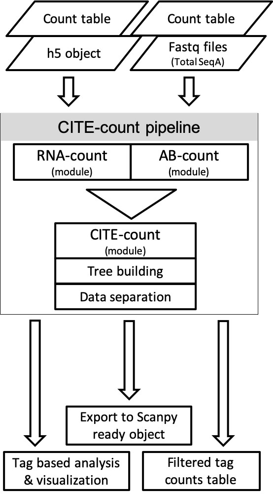
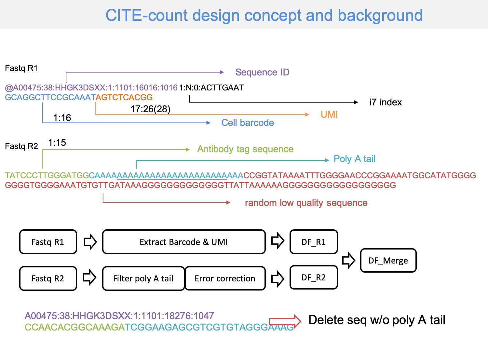
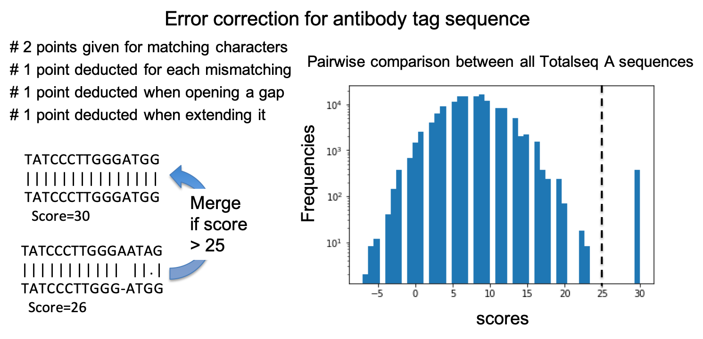
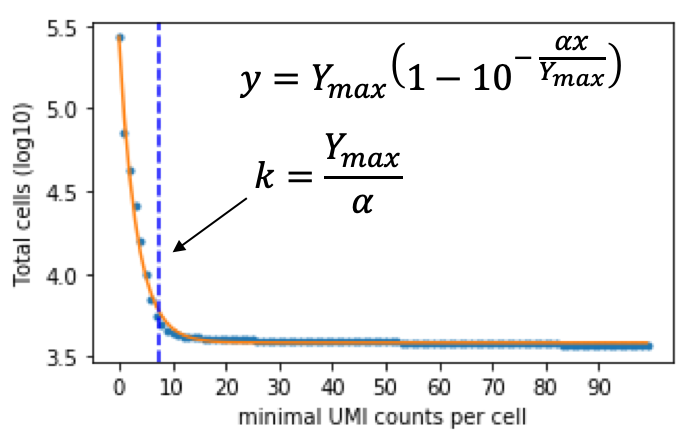
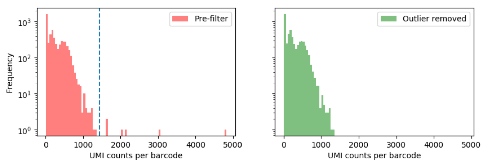
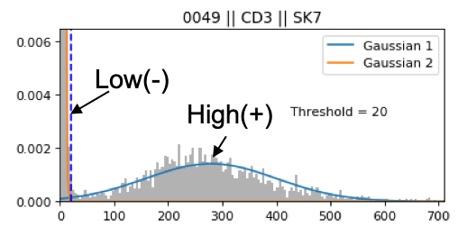
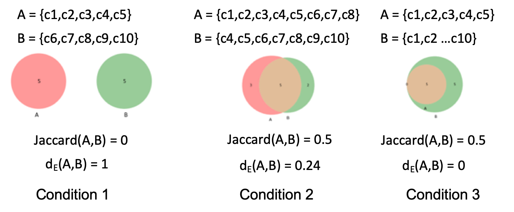

CITE-count (A pipeline compatible with Totalseq A 10X 3'capture)
============

* Motivation: As a popular antibody labeling technic, Totalseq A has been applied in CITE-Seq and LEAP-Seq based studies, yet the 10X software has very limited support for Totalseq A data preprocessing. Here we provided a pipeline that preprocess raw Totalseq A fastq files and conducts QC of the results. The pipeline can also import other totalseq data for QC, and merge with RNA-Seq result and export seamlessly to Scanpy pipeline.

* Dev concept: There has been many tool developed for CITE-Seq analysis and more are coming, therefore this package is focused on three objectives that will become useful add-ons to other main-stream packages.
	* Totalseq A preprocessing and QC support for all tag counts (see Fastq import and tag counts QC)
	* tag counts based cell separation and visualization
	* Integrated Scanpy support - all downstream analysis can be done in Scanpy without further importing step required   

Install test version:

<code>pip install -i https://test.pypi.org/simple/ cite-count==0.5.2</code>

# Fastq import and tag counts QC

## Fastq preprocessing

The development of this pipeline was based on 10X 3' capture version 3 chemistry, and information stored in the fastq sequences are demonstrated here.

------

## Antibody sequence recovery

Due to sequencing error, some of the antibody tag sequence in fastq R2 was not found in the reference list (But they should be). For such instances we designed an error correction algorithm to recover some of the mismatched reads by conducting pairwise comparison between the "no assignment" reads and reference tag sequence. More specifically, we first compare the similarity of the reference totalseq A sequence using a scoring system, and from the score frequency deduce a "safe" score for merging similar sequence without introducing false positive. Then we compare all of the unassigned tag reads to reference sequence, and if an unassigned read has score more than the "safe" value when comparing to a reference sequence (in this case 25), that read will be recovered and assigned to its corresponding tag counts.

------
## Minimal and maximal tag counts per library
Not all 10X GEM captured antibody tags are associated with the cell surface markers. There are two scenarios where bias were introduced to final tag counts: 1. tags bond to cell debris and/or some free floating tags been captured, and 2. a clump of antibody formed and been captured.

To address these issues, we first fit the Total cells (unique cell barcodes)/UNI-counts per cell data with a modified Platt function ( [Jassby & Platt, 1976](https://aslopubs.onlinelibrary.wiley.com/doi/epdf/10.4319/lo.1976.21.4.0540) ), and user can select a more stringent (full saturation) threshold for reducing false positive or less stringent (half saturation) threshold for higher recovery rate; a fixed threshold value is also available however not recommended.

For detecting outliers due to clumping, we assume the UMI counts per cell fits Gaussian distribution and filter out reads that is not within the distribution at given probability (default p = 10-6)

------

[Tutorial](https://github.com/ndu-UCSD/CITE-count/blob/master/Preprocessing.ipynb) on how to process fastq files with CITE-count.

# Tag based cell separation

## Classifying antibody tag counts

The tag counts data usually exhibit bimodal distribution, similar to the flow-cytometry data used for cell selection. Therefore, We used mixed Gaussian and other model to fit the tag signal and classify them as low/high (labeled -/+) based on their distributions.

With each cell been labeled based on their antibody distribution, we developed a new distance function named "Exclusive distance" to describe how much A and B are mutually exclusive from each other and are representative of two populations.

This function is similar to Jaccrd distance with better capacity separating conditions 2 and 3. The range of its output ranges from 0 to 1, which marks two populations are less or more mutually exclusive to each another.

Based on the mutual exclusive index calculated from the defined function, the cells can be separated in a way similar to the flow-cytometry based cell selection workflow ([Example](https://github.com/ndu-UCSD/CITE-count/blob/master/Combine_with_RNA_SEQ.ipynb)).
